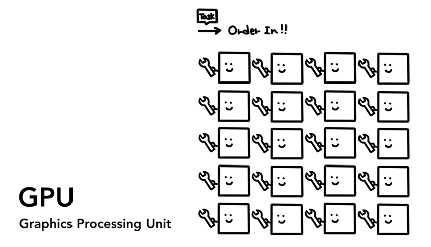

## GPU,CPU,内存和多进程架构

在这个由4个系列组成的博客中，我们将从*高级体系结构* (High Level Architecture)到*渲染流水线* (The Rendering Pipeline)的细节来深入的探究Chrome浏览器。如果你有想过浏览器是如何将你的代码转化成为一个实用的网页的，或者你不确定为什么某个特定的技术可用于性能提升，这个系列适合你。

在这个系列的第一部分，我们来看一看计算核心术语和Chrome的*多进程架构* (Multi-process Architecture)。

## 计算机的核心是CPU和GPU

为了理解浏览器运行时的环境，我们需要理解一点计算机部件和他们做了什么

### CPU

首先就是**CPU** (中央处理器, Central Processing Unit)。CPU可以看作是计算机的大脑。一个CPU的核心可以被描绘成为一个办公室的工作人员，在有很多不同的任务进来时一个接一个的处理他们。它可以处理各式各样的情况直到知道如何解决一个问题。在过去，大部分CPU都是一个芯片，一个内核就像一个芯片中有另一个CPU。在现代的硬件中，会有很多多核情况，用来给你的手机和电脑提供更高的计算能力。

### GPU

**GPU**(图形处理器, Graphics Processing Unit)是计算机的另一个组成部分，不同于CPU，GPU擅长处理简单的问题，但是可以多个核心同时计算。顾名思义，它一开始是为了处理图形而开发的。这就是为什么一般在处理图形时“使用GPU”或者“GPU支持”与快速渲染和流畅交互相关。最近几年，随着GPU计算的发展，GPU可以单独处理越来越多的计算。

当你在你的手机或者电脑上打开一个应用，CPU和GPU会为这个应用提供支撑。通常情况下，应用程序使用操作系统提供的机制来在CPU和GPU上运行。

## 在线程和进程中执行程序

在深入浏览器架构之前还需要掌握另一个概念是**线程** (Thread)和**进程**(Process)。进程可以描述为一个应用的执行程序。而线程是运行在进程中的且执行进程本身的任何部分程序。

当你打开一个应用时一个进程就被创建了。程序可能会创建一个或者多个线程来帮助它工作。操作系统会给线程分配一块内存的“板块”来帮助其工作，所有的应用程序状态会保存在这一块私有的内存空间中。当你关闭了应用程序，进程也会跟着消失，并且操作系统会释放分配的这部分内存。

一个进程可以要求操作系统启动另一个进程来执行不同的任务。当发生这种情况时，不同部分的内存会被分配给新的进程。如果这两个进程需要交互，他们可以通过**进程间通信**(Inner Progress Communication, **IPC**)来进行。很多应用程序被设计成这样以便当一个进程未响应时，它可以自己重启，而不影响其他正在运行应用程序其他部分的进程。

## 浏览器架构

那么浏览器是如何通过线程和进程来构建的呢？它可能是一个进程和多个线程，也有可能是多个不同的进程来使用几个执行IPC通信的线程。

这里需要注意的是，这些不同的架构只是实现的具体细节。对于如何制作一个浏览器而言，并没有一个标准的规范。两个浏览器的实现方式可能完全不同。

为了这个博客系列，我们将用最近的chrome浏览器的架构，如下图所描述的。

图中最上边的是**浏览器进程**(Browser Process)，它主要协调其他进程来处理应用中的不同的部分。对于**渲染器进程**(Renderer Process)来说，它会给每一个标签页创建并分配一个进程。直到最近，Chrome在它力所能及的情况下会给每一个标签页一个进程。现在它正尝试给每一个页面一个自己的进程，其中包括iframe。

## 每个进程的作用

| 进程的作用 |                                                              |
| ---------- | :----------------------------------------------------------- |
| 浏览器进程 | 控制chrome部分，其中包括地址栏，书签，后退和前进按钮。也控制着看不见的浏览器特权部分，比如说网络请求和文件访问。 |
| 渲染器进程 | 控制选项卡中的所有部分。                                     |
| 插件进程   | 控制网站使用的插件部分。                                     |
| GPU进程    | 单独处理其他进程分给它的GPU任务，它被分割出来是因为GPU需要处理多个应用程序的请求，并且要将它们绘制在同一个屏幕中。 |

其实浏览器还有更多的进程，像扩展进程(Extension process)和通用进程(utility processes)。如果你想知道你的chrome正在运行多少进程，点击右上角的更多按钮，选择更多工具(More Tools)，然后选择浏览器任务管理器(Task Manager)。点击之后会打开一个窗口，它会展示一个当前正在运行的进程列表，并且可以看到它们各自占用了多少CPU/内存。

## Chrome多进程架构的好处

前边我提到过Chrome使用多个渲染器进程。在大多数简单的情况下，你可以认为每个标签页都有它们自己的渲染器进程。假如你打开了三个标签页并且每个标签页都在一个独立的渲染器进程下。如果一个标签页崩溃了，你可以关掉这个崩溃的标签页并且切换到其他正常运行的标签页上。但如果所有标签页都是用一个渲染进程的话，当一个标签页崩溃了，所有的标签页都会跟着崩溃。难受住。

浏览器使用多进程的另一个好处是安全和沙盒化。因为操作系统提供了一个限制进程权限的方法，浏览器可以针对某些功能的某些进程进行沙盒化处理。举个例子，Chrome限制了可以处理任意用户输入的进程（渲染器进程）的获取任意文件的能力。(*For example, the Chrome browser restricts arbitrary file access for processes that handle arbitrary user input like the renderer process*)

进程都有它们自己私有的内存空间，并且它们经常包含通用基础文件的副本（像V8引擎）。这意味着会使用更多的内存，两个进程之间不能像同一进程内的线程一样共享内存。所以为了节省内存，Chrome限制了最多可以启动的线程数。限制数量的变化取决于你设备有多少内存和CPU功率。但是当Chrome达到它的极限时他会使用一个进程来渲染同域名(same site)的网站。

## 节省更多内存-Chrome的服务化

相同的方法也被应用在了浏览器进程。Chrome正在经历架构变化，执行每部分浏览器程序像服务一样，可以被简单的分割成不同的进程或者合并成为一个进程。

一般的想法是当Chrome运行在性能强的硬件上时，他可以把每个服务拆分成不同的进程来提供更高的稳定性，但如果它处于一个资源受限的设备中，Chrome会将各项服务整合到同一个进程中以节约内存。整合进程来节约内存占用的相似实现方法已经被安卓所使用。

## Per-frame renderer processes - Site Isolation

站点隔离是最近Chrome新引入的功能，它为每个跨站点的页面运行单独的渲染器进程。我们已经讨论了给每一个的页面分配一个渲染器进程，它会允许跨站点页面使用同一个渲染器进程并且彼此共享内存。在同一个渲染器进程下运行a.com和b.com看起来没问题。同源策略(Same Origin Policy)是核心安全模型，它确保了一个页面不能在没有允许的情况下获取另一个页面的数据。绕过这个策略是安全攻击的初级目标。进程隔离是分隔网站的最有效的方法。With Meltdown and Spectre，我们需要用进程分隔网站变得更为明显了。随着Chrome67中站点隔离被默认开启，每个跨站的页面都会有一个被隔离的渲染器进程。

启用站点隔离是很多工程师多年的努力。站点隔离不仅是分配不同的渲染器进程那么简单。它从根本上来说改变了页签互相交互的方式。在一个有iframe且用着不同的渲染器进程的页面中打开开发者工具，意味着开发者工具必须实现幕后的工作，使其看起来是无缝的。即使是运行一个简单的查询字符，在页面中就意味着要穿过不同的渲染器进程来执行查找。这就是为什么浏览器工程师说站点隔离更新是一个重大的里程碑。

## 总结

在这篇文章中，我们包含了从高等级视角研究浏览器架构，也包含了多进程架构的好处。我们还包含了与多进程架构密切相关的Chrome的服务化和站点隔离。在下篇文章中，我们将深入研究在展示一个网页的过程中这些进程和线程做了哪些事情。

[原文： Inside look at modern web browser (part 1)  | Web  | Google Developers](https://developers.google.com/web/updates/2018/09/inside-browser-part1)

**小学英文水平翻译的**
