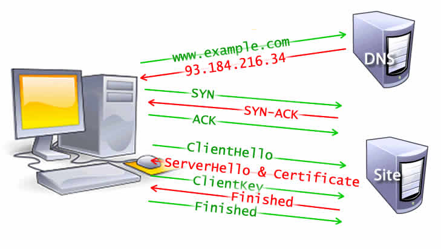

# 浏览器工作原理以及步骤

## 导航

### DNS查找

> DNS (Domain Name System)域名系统是管理IP与主机名之间关系的系统 **是应用层协议**  
> [详细](../net/dns.md)

查找步骤

1. 查找本地缓存
2. 查找本地HOST文件
3. 路由器缓存
4. 运营商缓存
5. DNS服务器

---

### TCP握手

当获取到服务器IP地址的时候，浏览器就会通过TCP的“三次握手”与服务器建立连接

> TCP三次握手：SYN,SYN-ACK,ACK

握手步骤

1. 开始握手前客户端处于closed状态,服务端处于listen状态
2. 开始握手，客户端向服务端发送一个SYN报文，并指明客户端的初始化序列号为ISN，SYN=1,seq=x，且客户端处于SYN_SEND状态。
3. 当服务端接收到客户端的SYN报文后，会用自己的SYN报文应答，并指定服务端的初始化序列号为ISN。同时会把客户端的ISN + 1作为ACK的值，表示自己已经受到客户端的SYN报文，SYN=1,seq=y,ACK=1,ack=x+1，此时服务端处于SYN_REVD状态。
4. 客户端收到服务端的SYN报文后会发送一个客户端的ACK报文同样把服务端的ISN+1作为ACK的值表示已经收到SYN报文, ACK=1,ack=y+1,seq=x+1，此时客户端处于ESTABLISHED状态。
5. 服务端端收到ACK报文后改变状态为ESTABLISHED，并开始传输数据。

> SYN=1的报文不能携带数据，且消耗掉一个序号  
> ACK的报文可以携带数据，不携带数据不需要消耗序号

---

### TLS协商

为了在HTTPS上建立安全连接需要使用TSL协商，它决定了什么密码用来加密通信。

> HTTPS会经过8次往返才能发出真正的请求  
> HTTPS是HTTP + SSL/TCP的简称  
> TLS是升级版的SSL，现在所使用的SSL基本都是TLS  
> 详细 [TLS](../net/tls.md)

步骤

1. 客户端发送client_hello
2. 服务端发送server_hello
3. 服务端发送证书
4. 客户端发送client_key(pre-master)
5. 服务端响应发送finish
6. 客户端响应发送finish

--- 

---

## 响应
